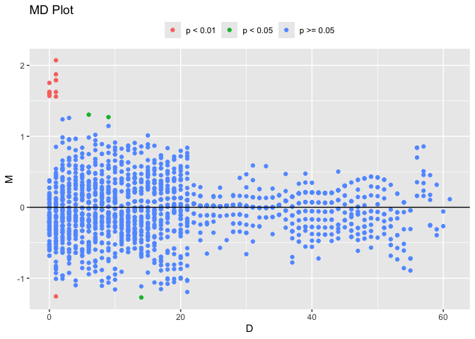

<!-- README.md is generated from README.Rmd. Please edit that file -->

# Introduction

`scHiCcompare` is designed for the imputation, joint normalization, and
detection of differential chromatin interactions between two groups of
chromosome-specific single-cell Hi-C datasets (scHi-C). The groups can
be pre-defined based on biological conditions or created by clustering
cells according to their chromatin interaction patterns. Clustering can
be performed using methods like
[Higashi](https://github.com/ma-compbio/Higashi),
[scHiCcluster](https://github.com/zhoujt1994/scHiCluster) methods, etc.

`scHiCcompare` works with processed Hi-C data, specifically
chromosome-specific chromatin interaction matrices, and accepts
five-column tab-separated text files in a sparse matrix format.

The package provides two key functionalities:

- Imputation of single-cell Hi-C data by random forest model with
  pooling technique
- Differential analysis to identify differences in chromatin
  interactions between groups.

# Installation

``` r
if (!requireNamespace("BiocManager", quietly = TRUE)) {
  install.packages("BiocManager")
}

BiocManager::install("scHiCcompare")

# For the latest version install from GitHub
# devtools::install_github("dozmorovlab/scHiCcompare")
```

``` r
library(scHiCcompare)
library(tidyr)
library(ggplot2)
library(gridExtra)
library(lattice)
library(data.table)
```

# Usage

## Input

To use scHiCcompare, you’ll need to define two groups of cells to
compare and save cell-specific scHi-C data (individual files in **.txt**
format) in two folders.

Each cell-specific scHi-C **.txt** file should be formatted as modified
sparse upper triangular matrices in R, which consist of five columns
(chr1, start1, chr2, start2, IF). Since the full matrix of chromatin
interactions is symmetric, only the upper triangular portion, including
the diagonal and excluding any 0, is stored in a sparse matrix format.
The required sparse matrix format of each single-cell Hi-C is:

- “chr1” - Chromosome of the first region.
- “start1” - a start coordinate (in bp) of the first region.
- “chr2” - Chromosome of the second region.
- “start2” - a start coordinate (in bp) of the second region.
- “IF” - the interaction frequency between 2 two regions (IFs).

The ‘.txt’ files need to be saved in tab-separated columns and no row
names, column names, or quotes around character strings with the example
format below.

    #>        chr1  start1  chr2  start2  IF
    #> 17669 chr20       0 chr20       0 128
    #> 17670 chr20       0 chr20 1000000   1
    #> 17671 chr20 1000000 chr20 1000000 179
    #> 17672 chr20       0 chr20 2000000   1
    #> 17673 chr20 1000000 chr20 2000000   1
    #> 17674 chr20 2000000 chr20 2000000 174

To run `scHiCcompare()`, you need two folders with condition-specific
scHiC ‘.txt’ files. The condition-specific groups of cells should be
pre-defined based on criteria such as experimental conditions,
clustering results, or biological characteristics.

### Prepare input folders

Here is an example workflow using scHiC human brain datasets (Lee et
al., 2019) with ODC and MG cell types at chromosome 20 with a 1MB
resolution.

For the following example sections, we will load samples of 10
single-cell Hi-C data (in ‘.txt’) for each cell type group in two
example folders (`ODCs_example` and `MGs_axample`). The files follow the
same format as those downloaded via `download_schic()` of `Bandnorm`.
You can extract the folder path by the code below, which could be used
as input for `scHiCcompare()` function.

``` r
## Load folder of ODC file path
ODCs_example_path <- system.file("ODCs_example", package = "scHiCcompare")

## Load folder of MG file path
MGs_example_path <- system.file("MGs_example", package = "scHiCcompare")
```

Since the data downloaded by `Bandnorm` has the required input format (5
columns of \[chr1, start1, chr2, start2, IF\]), we don’t need an extra
step for data modification. If, after importing your data into R, its
format does not follow the sparse upper triangular [input](#input)
format requirement, you need to modify the data.

## scHiCcompare function

The function requires two *Input Parameter*:

- `file.path.1, file.path.2` - Character strings specifying paths to
  folders containing scHi-C data for the first and second cell type or
  condition groups.
- `select.chromosome` - Integer or character indicating the chromosome
  to be analyzed (e.g., ‘chr1’ or ‘chr10’.)

``` r
scHiCcompare(file.path.1, file.path.2,
  select.chromosome,
  main.Distances = 1:10000000,
  imputation = "RF",
  normalization = "LOESS",
  differential.detect = "MD.cluster",
  pool.style = "progressive", n.imputation = 5,
  maxit = 1, outlier.rm = TRUE, missPerc.threshold = 95,
  A.min = NULL, fprControl.logfc = 0.8, alpha = 0.05,
  Plot = T, Plot.normalize = F, save.output.path = NULL
)
```

*Optional Workflow Parameter* include:

- `main.Distances` - A numeric vector indicating the range of
  interacting genomic distances (in base pairs) between two regions
  (e.g., loci or bins) to focus on (e.g., `1:100000`, `Inf`). All
  genomic range selections can be specified using `Inf`. The
  `main.Distances` vector should be proportional to the data’s
  resolution (e.g., for 10kb resolution: `1:10000`, `1:50000`,
  `1:100000`, `Inf`). As the distance range and resolution increase, the
  percentage of ‘0’ or missing values also increases. Selecting a large
  distance range at high resolution (e.g., below 200kb) may increase
  runtime due to extreme sparsity. By default, `main.Distances` =
  `1:10000000`.

- `imputation` - A character string, either `'RF'` or `NULL`, indicating
  the imputation method. If `NULL` is selected, the workflow will skip
  the `imputation` step. The default is `'RF'` for Random Forest
  imputation.

- `normalization` - A character string, either `'LOESS'` or `NULL`,
  indicating the normalization method. If `NULL` is selected, the
  workflow will skip the `normalization` step. The default is `'LOESS'`.

*Optional Imputation Parameter* include:

- `pool.style` - A character string specifying the pooling style for
  `imputation`. Options are `'none'`, `'progressive'`, or `'Fibonacci'`.
  The default is `'progressive'`.

- `n.imputation` - An integer specifying the number of multiple
  imputations for the imputation step. Because the final imputed values
  are calculated as the average of multiple imputations, increasing the
  number of imputations improves the accuracy of imputed values;
  however, it may also extend the imputation runtime. The default is
  `5`.

- `maxit` - An integer specifying the maximum number of iterations for
  the internal refinement process within a single `imputation` cycle.
  Increasing `maxit` can help stabilize imputed values, although it may
  increase the imputation runtime. The default is `1`.

- `outlier.rm` - Logical. If `TRUE`, outliers are removed during
  `imputation`. The default is `TRUE`.

- `missPerc.threshold` - A numeric value specifying the maximum
  allowable percentage of missing data in pool bands outside the
  `main.Distances` to be imputed by the `imputation` method. A higher
  threshold includes more extreme sparse distances for imputation (e.g.,
  above 95 percent), which increases memory and runtime, while a lower
  threshold (e.g., below 50 percent) might reduce the number of
  distances imputed. The default is `95`.

*Optional Normalization Parameter* include:

- `A.min` - Numeric value or NULL that sets the A-value quantile cutoff
  (eg,. 7, 10, etc) for filtering low average interaction frequencies in
  the outlier detection in the differential step of the `hic_compare()`
  function from `HiCcompare`. If not provided (NULL), A is
  auto-detected.

*Optional Differential Test Parameter* include:

- `fprControl.logfc` - Numeric value to control the false positive rate
  for GMM difference clusters (`differential.detect`) (e.g., 0.5, 0.8,
  1, 1.5, etc.). Increasing `fprControl.logfc` may lower the false
  positive rate but may also reduce the number of detected chromatin
  interaction differences. The default is 0.8, equivalent to a 2-fold
  change.

- `alpha` - Numeric value specifying the significance level for outlier
  detection during the `differential.detect` step with the
  `hic_compare()` function from HiCcompare. Default is 0.05.

*Optional Output Parameter* :

- `save.output.path` - Character string specifying the directory to save
  outputs, including the imputed cells in the form of a sparse upper
  triangular format, normalization result table, and differential
  analysis result table. If `save.output.path` = NULL (the default), no
  files are saved.

- `Plot` - A logical value indicating whether to plot the
  `differential.detect` results in an MD plot. Default is TRUE.

- `Plot.normalize` - A logical value indicating whether to plot the
  output of MD plot showing before/after LOESS `normalization`. Default
  is FALSE.

### Example of real analysis

In the following example, we will work with scHi-C data from 10 single
cells in both ODC and MG cell types at a 1 MG resolution. We will focus
on chromosome 20, applying the full workflow of scHiCcompare, which
includes imputation, pseudo-bulk normalization, and differential
analysis. Our goal is to detect differences for loci with genomic
distances ranging from 1 to 10,000,000 bp. The progressive pooling style
will be selected to create pool bands for the random forest imputation.
For the differential analysis step, we will set the log fold change -
false positive control threshold to 0.8.

The input file path was included in the package and conducted in the
[Prepare input folders](#prepare-input-folders) section.

``` r
## Imputation with 'progressive' pooling
result <- scHiCcompare(
  file.path.1 = ODCs_example_path,
  file.path.2 = MGs_example_path,
  select.chromosome = "chr20",
  main.Distances = 1:10000000,
  imputation = "RF",
  normalization = "LOESS",
  differential.detect = "MD.cluster",
  pool.style = "progressive",
  fprControl.logfc = 0.8,
  Plot = TRUE,
  Plot.normalize = TRUE
)
```



From the visualizations above, normalization effectively reduces the
irregular trend in the M values between the imputed pseudo-bulk matrices
of the two cell types. At a 1MB resolution, the differential analysis
reveals that most of the detected differences occur at closer genomic
distances, particularly below 5MB.

## Output

#### Output objects from the R function

The `scHiCcompare()` function will return an object that contains plots,
differential results, pseudo-bulk matrices, normalized results, and
imputation tables. The full differential results are available in
`$Differential_Analysis`. Intermediate results can be accessed with
`$Intermediate`, including the imputation result table
(`$Intermediate$Imputation`), the pseudo-bulk matrix in sparse format
(`$Intermediate$PseudoBulk`), and the normalization table
(`$Intermediate$Bulk.Normalization`). These output table objects have
the following structure:

- `$Intermediate$PseudoBulk` for each condition group (`$condition1` and
  `$condition2`) has a standard sparse upper triangular format with 3
  columns of \[region1, region2, IF\].

- `$Intermediate$Imputation` for each condition group (`$condition1` and
  `$condition2`) has modified sparse upper triangular format:

  - Interacting bins coordination \[region1, region2, cell (condition 1
    or condition2), chr\]
  - Imputed interaction frequency of each single-cell \[imp.IF\_{cell
    name 1}, imp.IF\_{cell name 2}, imp.IF\_{cell name 3}, …,etc\]

- `$Intermediate$Bulk.Normalization` has 15 columns

  - Interacting bins coordination \[chr1, start1, end1, chr2, start2,
    end2, D (scaled genomic distance)\]
  - Bulk IF values \[bulk.IF1, bulk.IF2, M (their log fold change,
    $log(IF_2/IF_1)$)\]
  - Normalized bulk IF values \[adj.bulk.IF1, adj.bulk.IF2, adj.M (their
    log fold change, $log(adj.IF_2/adj.IF_1)$)\]
  - LOESS correction factor \[mc\];
  - Average expression value of bulk IF \[A\].

- `$Differential_Analysis` has same structure as
  `$Intermediate$Bulk.Normalization` with addition of 2 differential
  detection results columns

  - Z score of interaction frequencies’s log fold change \[Z\]
  - Differential result cluster \[Difference.cluster\]

#### Externally saved output files

You also can have the option to save the results into the chosen
directory by a parameter in `scHiCcompare()`
[function](#schiccompare-function). This will save the normalization
result table, differential result table, and imputed cell scHi-C data
(each group is a sub-folder). The sample of the saved output folder
structure is:

- Bulk_normalization_table.txt
- Differential_analysis_table.txt
- Imputed\_{group 1’s name} └── + imp\_{cell name}.txt
- Imputed\_{group 2’s name} └── + imp\_{cell name}.txt

The normalization result `Bulk_normalization_table.txt` has the same
format as the output object from the `scHiCcompare()` function,
`$Intermediate$Bulk.Normalization`, which is shown in the structure
example below.

The differential result table `Differential_analysis_table.txt` also has
the same format as the output object `$Differential_Analysis` from the
function.

The imputed cell’s scHiC data is saved in a folder for each group, which
has a modified sparse upper triangular format of five columns \[chr1,
start1, chr2, start2, IF\].

### Example of output

Below is a continuous example from [Example of real
anlysis](#example-of-real-anlysis) above, showing how you can extract
different result options from the `scHiCcompare()` function.

``` r
### Extract imputed differential result
diff_result <- result$Differential_Analysis
head(diff_result)
#>      chr1 start1  end1   chr2 start2  end2 bulk.IF1 bulk.IF2     D           M
#>    <char>  <num> <num> <char>  <num> <num>    <num>    <num> <num>       <num>
#> 1:  chr20  0e+00 1e+06  chr20  1e+06 2e+06       28       34     1  0.28010792
#> 2:  chr20  1e+06 2e+06  chr20  2e+06 3e+06       29       48     1  0.72698151
#> 3:  chr20  2e+06 3e+06  chr20  3e+06 4e+06       32       19     1 -0.75207249
#> 4:  chr20  3e+06 4e+06  chr20  4e+06 5e+06       26       26     1  0.00000000
#> 5:  chr20  4e+06 5e+06  chr20  5e+06 6e+06       39       37     1 -0.07594885
#> 6:  chr20  5e+06 6e+06  chr20  6e+06 7e+06       38       26     1 -0.54748780
#>    adj.bulk.IF1 bulk.adj.IF2      adj.M         mc        A          Z
#>           <num>        <num>      <num>      <num>    <num>      <num>
#> 1:     26.23038     36.29379  0.4684842 -0.1883762 31.26209  2.1542193
#> 2:     27.16718     51.23830  0.9153577 -0.1883762 39.20274  4.2095550
#> 3:     29.97758     20.28183 -0.5636962 -0.1883762 25.12970 -2.5931575
#> 4:     24.35678     27.75408  0.1883762 -0.1883762 26.05543  0.8659001
#> 5:     36.53517     39.49619  0.1124274 -0.1883762 38.01568  0.5165834
#> 6:     35.59837     27.75408 -0.3591116 -0.1883762 31.67623 -1.6521974
#>    Difference.cluster
#>                 <num>
#> 1:                  0
#> 2:                  0
#> 3:                  0
#> 4:                  1
#> 5:                  1
#> 6:                  1
```

``` r
### Extract imputed pseudo bulk matrices normalization
norm_result <- result$Intermediate$Bulk.Normalization
head(norm_result)
#>      chr1 start1  end1   chr2 start2  end2 bulk.IF1 bulk.IF2     D          M
#>    <char>  <num> <num> <char>  <num> <num>    <num>    <num> <num>      <num>
#> 1:  chr20  1e+06 2e+06  chr20  1e+06 2e+06     1823     2111     0 0.21161202
#> 2:  chr20  2e+06 3e+06  chr20  2e+06 3e+06     1931     2187     0 0.17960506
#> 3:  chr20  3e+06 4e+06  chr20  3e+06 4e+06     1750     2114     0 0.27262045
#> 4:  chr20  4e+06 5e+06  chr20  4e+06 5e+06     1953     2091     0 0.09850111
#> 5:  chr20  5e+06 6e+06  chr20  5e+06 6e+06     1799     2010     0 0.16000031
#> 6:  chr20  6e+06 7e+06  chr20  6e+06 7e+06     1808     2056     0 0.18544559
#>    adj.bulk.IF1 bulk.adj.IF2        adj.M        mc        A
#>           <num>        <num>        <num>     <num>    <num>
#> 1:     1932.385     1991.505  0.043476476 0.1681355 1961.945
#> 2:     2046.865     2063.203  0.011469514 0.1681355 2055.034
#> 3:     1855.005     1994.335  0.104484913 0.1681355 1924.670
#> 4:     2070.185     1972.637 -0.069634429 0.1681355 2021.411
#> 5:     1906.945     1896.222 -0.008135227 0.1681355 1901.583
#> 6:     1916.485     1939.618  0.017310045 0.1681355 1928.051
```

``` r
### Extract imputed ODC cell type table
imp_ODC_table <- result$Intermediate$Imputation$condition1
head(imp_ODC_table)
#>   region1 region2       cell   chr imp.IF_ODC.bandnorm_chr20_1
#> 1   1e+06   1e+06 condition1 chr20                         179
#> 2   2e+06   2e+06 condition1 chr20                         174
#> 3   3e+06   3e+06 condition1 chr20                         194
#> 4   4e+06   4e+06 condition1 chr20                         201
#> 5   5e+06   5e+06 condition1 chr20                         171
#> 6   6e+06   6e+06 condition1 chr20                         142
#>   imp.IF_ODC.bandnorm_chr20_2 imp.IF_ODC.bandnorm_chr20_3
#> 1                         195                         192
#> 2                         204                         226
#> 3                         207                         198
#> 4                         220                         228
#> 5                         193                         208
#> 6                         181                         200
#>   imp.IF_ODC.bandnorm_chr20_4 imp.IF_ODC.bandnorm_chr20_5
#> 1                         134                         164
#> 2                         153                         186
#> 3                         136                         165
#> 4                         147                         194
#> 5                         173                         156
#> 6                         153                         188
#>   imp.IF_ODC.bandnorm_chr20_6 imp.IF_ODC.bandnorm_chr20_7
#> 1                          52                         204
#> 2                          67                         215
#> 3                          50                         194
#> 4                          54                         220
#> 5                          61                         210
#> 6                          56                         219
#>   imp.IF_ODC.bandnorm_chr20_8 imp.IF_ODC.bandnorm_chr20_9
#> 1                         259                         249
#> 2                         231                         247
#> 3                         212                         206
#> 4                         272                         212
#> 5                         191                         244
#> 6                         237                         224
#>   imp.IF_ODC.bandnorm_chr20_10
#> 1                          195
#> 2                          228
#> 3                          188
#> 4                          205
#> 5                          192
#> 6                          208
```

``` r
## Extract Pseudo-bulk matrix from imputed scHi-C data
## Pseudo bulk matrix in standard sparse format
psudobulk_result <- result$Intermediate$PseudoBulk$condition1
head(psudobulk_result)
#>   region1 region2   IF
#> 1   1e+06   1e+06 1823
#> 2   2e+06   2e+06 1931
#> 3   3e+06   3e+06 1750
#> 4   4e+06   4e+06 1953
#> 5   5e+06   5e+06 1799
#> 6   6e+06   6e+06 1808
```

Furthermore, you also have some parameter options in the function to
indicate which plots to output and an option to save the results in a
given directory.

# Helper functions

There are several other functions included in `scHiCcompare` package.

## Heatmap HiC matrix plot

`plot_HiCmatrix_heatmap()` produces a heatmap visualization for HiC and
scHiC matrices. It requires, as input, a modified sparse matrix, the
same format from `scHiCcompare()` [Input](#input) with five columns of
chr1, start1, chr2 start2, IF. More information can be found in its help
document and the example below.

``` r
data("ODC.bandnorm_chr20_1")
plot_HiCmatrix_heatmap(scHiC.sparse = ODC.bandnorm_chr20_1, main = "scHiC matrix of a ODC cell", zlim = c(0, 5))
#> Matrix dimensions: 63x63
```


## Imputation Diagnostic plot

`plot_imputed_distance_diagnostic()` generates a diagnostic
visualization of imputation across genomic distances for all single
cells. It compares the distribution of all cells’ interaction frequency
at a given distance data before and after imputation. It requires, as
input, the scHiC table format of the original and imputed scHiC
datasets. ScHiC table format includes columns of genomic loci
coordinates and interaction frequencies (IF) of each cell (cell,
chromosome, start1, end1, IF1, IF2, IF3, etc).

The output of `$Intermediate$Imputation` of `scHiCcompare()` function is
directly compatible with this format. For more details, see the sections
on [Output](#output))

``` r
# Extract imputed table result
imp_MG_table <- result$Intermediate$Imputation$condition2
imp_ODC_table <- result$Intermediate$Imputation$condition1
```

    #>   region1 region2       cell   chr imp.IF_ODC.bandnorm_chr20_1
    #> 1   1e+06   1e+06 condition1 chr20                         179
    #> 2   2e+06   2e+06 condition1 chr20                         174
    #> 3   3e+06   3e+06 condition1 chr20                         194
    #> 4   4e+06   4e+06 condition1 chr20                         201
    #> 5   5e+06   5e+06 condition1 chr20                         171
    #> 6   6e+06   6e+06 condition1 chr20                         142
    #>   imp.IF_ODC.bandnorm_chr20_2 imp.IF_ODC.bandnorm_chr20_3
    #> 1                         195                         192
    #> 2                         204                         226
    #> 3                         207                         198
    #> 4                         220                         228
    #> 5                         193                         208
    #> 6                         181                         200
    #>   imp.IF_ODC.bandnorm_chr20_4 imp.IF_ODC.bandnorm_chr20_5
    #> 1                         134                         164
    #> 2                         153                         186
    #> 3                         136                         165
    #> 4                         147                         194
    #> 5                         173                         156
    #> 6                         153                         188
    #>   imp.IF_ODC.bandnorm_chr20_6 imp.IF_ODC.bandnorm_chr20_7
    #> 1                          52                         204
    #> 2                          67                         215
    #> 3                          50                         194
    #> 4                          54                         220
    #> 5                          61                         210
    #> 6                          56                         219
    #>   imp.IF_ODC.bandnorm_chr20_8 imp.IF_ODC.bandnorm_chr20_9
    #> 1                         259                         249
    #> 2                         231                         247
    #> 3                         212                         206
    #> 4                         272                         212
    #> 5                         191                         244
    #> 6                         237                         224
    #>   imp.IF_ODC.bandnorm_chr20_10
    #> 1                          195
    #> 2                          228
    #> 3                          188
    #> 4                          205
    #> 5                          192
    #> 6                          208

We need to create the table input for original IFs values in the same
format. Below is a continuous example from [Example of real
anlysis](#example-of-real-anlysis) above, showing how you can construct
scHiC table for original IF values and compare them with the output of
imputed IF values.

``` r
# Create scHiC table object for original ODC interaction frequencies (IF)
scHiC.table_ODC <- imp_ODC_table[c("region1", "region2", "cell", "chr")]

# List all files in the specified directory for original ODC data
file.names <- list.files(path = ODCs_example_path, full.names = TRUE, recursive = TRUE)

# Loop through each file to read and merge data
for (i in 1:length(file.names)) {
  # Read the current file into a data frame
  data <- read.delim(file.names[[i]])
  names(data) <- c("chr", "region1", "chr2", "region2", paste0("IF_", i))
  data <- data[, names(data) %in%
    c("chr", "region1", "region2", paste0("IF_", i))]
  # Merge the newly read data with the existing scHiC.table_ODC
  scHiC.table_ODC <- merge(scHiC.table_ODC, data,
    by = c("region1", "region2", "chr"), all = TRUE
  )
}


# Create scHiC table object for original MG interaction frequencies (IF)
scHiC.table_MG <- imp_MG_table[c("region1", "region2", "cell", "chr")]
# List all files in the specified directory for original MG data
file.names <- list.files(path = MGs_example_path, full.names = TRUE, recursive = TRUE)

# Loop through each file to read and merge data
for (i in 1:length(file.names)) {
  # Read the current file into a data frame
  data <- read.delim(file.names[[i]])
  names(data) <- c("chr", "region1", "chr2", "region2", paste0("IF_", i))
  data <- data[, names(data) %in%
    c("chr", "region1", "region2", paste0("IF_", i))]
  # Merge the newly read data with the existing scHiC.table_MG
  scHiC.table_MG <- merge(scHiC.table_MG, data,
    by = c("region1", "region2", "chr"), all = TRUE
  )
}
```

``` r
# plot imputed Distance Diagnostic of MG
plot1 <- plot_imputed_distance_diagnostic(
  raw_sc_data = scHiC.table_MG,
  imp_sc_data = imp_MG_table, D = 1
)
plot2 <- plot_imputed_distance_diagnostic(
  raw_sc_data = scHiC.table_MG,
  imp_sc_data = imp_MG_table, D = 2
)
plot3 <- plot_imputed_distance_diagnostic(
  raw_sc_data = scHiC.table_MG,
  imp_sc_data = imp_MG_table, D = 3
)
plot4 <- plot_imputed_distance_diagnostic(
  raw_sc_data = scHiC.table_MG,
  imp_sc_data = imp_MG_table, D = 4
)
grid.arrange(plot1, plot2, plot3, plot4, ncol = 2, nrow = 2)
```


The diagnostic visualizations demonstrate that with a sample of only 10
single cells per group (note: this small sample size is for
demonstration purposes only), the imputed values for MG closely match
the original distribution only at shorter genomic distances (e.g., D1,
D2). Increasing the number of single cells per group enhances imputation
accuracy across distances. We recommend using a minimum of 80 single
cells per group for optimal imputation performance.

# Session Info

    #> R version 4.2.3 (2023-03-15)
    #> Platform: x86_64-apple-darwin17.0 (64-bit)
    #> Running under: macOS Big Sur ... 10.16
    #> 
    #> Matrix products: default
    #> BLAS:   /Library/Frameworks/R.framework/Versions/4.2/Resources/lib/libRblas.0.dylib
    #> LAPACK: /Library/Frameworks/R.framework/Versions/4.2/Resources/lib/libRlapack.dylib
    #> 
    #> locale:
    #> [1] en_US.UTF-8/en_US.UTF-8/en_US.UTF-8/C/en_US.UTF-8/en_US.UTF-8
    #> 
    #> attached base packages:
    #> [1] stats     graphics  grDevices utils     datasets  methods   base     
    #> 
    #> other attached packages:
    #> [1] data.table_1.16.2   lattice_0.22-6      gridExtra_2.3      
    #> [4] ggplot2_3.5.1       tidyr_1.3.1         scHiCcompare_0.99.0
    #> 
    #> loaded via a namespace (and not attached):
    #>   [1] minqa_1.2.6                 colorspace_2.1-1           
    #>   [3] CGHcall_2.60.0              mclust_6.0.1               
    #>   [5] DNAcopy_1.72.3              XVector_0.38.0             
    #>   [7] GenomicRanges_1.50.2        rstudioapi_0.17.0          
    #>   [9] mice_3.16.0                 farver_2.1.2               
    #>  [11] listenv_0.9.1               fansi_1.0.6                
    #>  [13] HiCcompare_1.20.0           ranger_0.16.0              
    #>  [15] codetools_0.2-20            splines_4.2.3              
    #>  [17] R.methodsS3_1.8.2           impute_1.72.3              
    #>  [19] knitr_1.48                  Formula_1.2-5              
    #>  [21] nloptr_2.0.3                Rsamtools_2.14.0           
    #>  [23] broom_1.0.7                 miceadds_3.16-18           
    #>  [25] R.oo_1.26.0                 pheatmap_1.0.12            
    #>  [27] compiler_4.2.3              backports_1.5.0            
    #>  [29] Matrix_1.6-4                fastmap_1.2.0              
    #>  [31] limma_3.54.2                cli_3.6.3                  
    #>  [33] htmltools_0.5.8.1           tools_4.2.3                
    #>  [35] gtable_0.3.5                glue_1.8.0                 
    #>  [37] GenomeInfoDbData_1.2.9      dplyr_1.1.4                
    #>  [39] Rcpp_1.0.13                 carData_3.0-5              
    #>  [41] Biobase_2.58.0              vctrs_0.6.5                
    #>  [43] Biostrings_2.66.0           rhdf5filters_1.10.1        
    #>  [45] nlme_3.1-164                iterators_1.0.14           
    #>  [47] QDNAseq_1.34.0              xfun_0.48                  
    #>  [49] globals_0.16.3              lme4_1.1-35.5              
    #>  [51] lifecycle_1.0.4             gtools_3.9.5               
    #>  [53] rstatix_0.7.2               InteractionSet_1.26.1      
    #>  [55] future_1.34.0               pan_1.9                    
    #>  [57] zlibbioc_1.44.0             MASS_7.3-60.0.1            
    #>  [59] scales_1.3.0                MatrixGenerics_1.10.0      
    #>  [61] parallel_4.2.3              SummarizedExperiment_1.28.0
    #>  [63] rhdf5_2.42.1                RColorBrewer_1.1-3         
    #>  [65] yaml_2.3.10                 rpart_4.1.23               
    #>  [67] CGHbase_1.58.0              highr_0.11                 
    #>  [69] S4Vectors_0.36.2            foreach_1.5.2              
    #>  [71] BiocGenerics_0.44.0         boot_1.3-31                
    #>  [73] BiocParallel_1.32.6         shape_1.4.6.1              
    #>  [75] GenomeInfoDb_1.34.9         rlang_1.1.4                
    #>  [77] pkgconfig_2.0.3             matrixStats_1.4.1          
    #>  [79] bitops_1.0-9                evaluate_1.0.1             
    #>  [81] purrr_1.0.2                 Rhdf5lib_1.20.0            
    #>  [83] labeling_0.4.3              tidyselect_1.2.1           
    #>  [85] parallelly_1.38.0           magrittr_2.0.3             
    #>  [87] R6_2.5.1                    IRanges_2.32.0             
    #>  [89] generics_0.1.3              mitml_0.4-5                
    #>  [91] DelayedArray_0.24.0         DBI_1.2.3                  
    #>  [93] withr_3.0.1                 pillar_1.9.0               
    #>  [95] mgcv_1.9-1                  abind_1.4-8                
    #>  [97] survival_3.7-0              RCurl_1.98-1.16            
    #>  [99] nnet_7.3-19                 tibble_3.2.1               
    #> [101] future.apply_1.11.2         crayon_1.5.3               
    #> [103] car_3.1-3                   jomo_2.7-6                 
    #> [105] KernSmooth_2.23-22          utf8_1.2.4                 
    #> [107] rmarkdown_2.28              grid_4.2.3                 
    #> [109] marray_1.76.0               digest_0.6.37              
    #> [111] R.utils_2.12.3              stats4_4.2.3               
    #> [113] munsell_0.5.1               glmnet_4.1-8               
    #> [115] mitools_2.4
