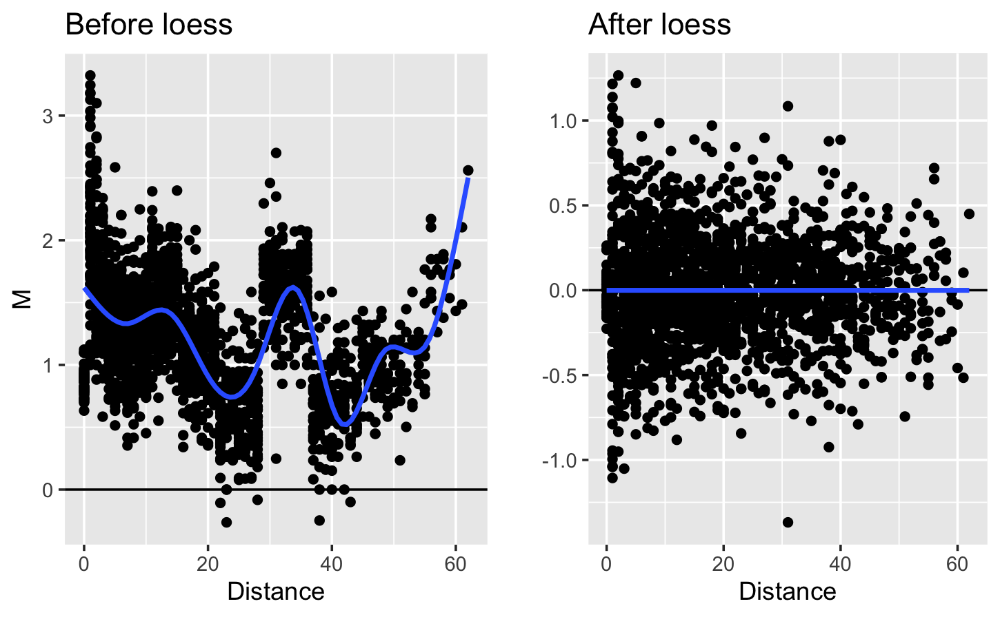
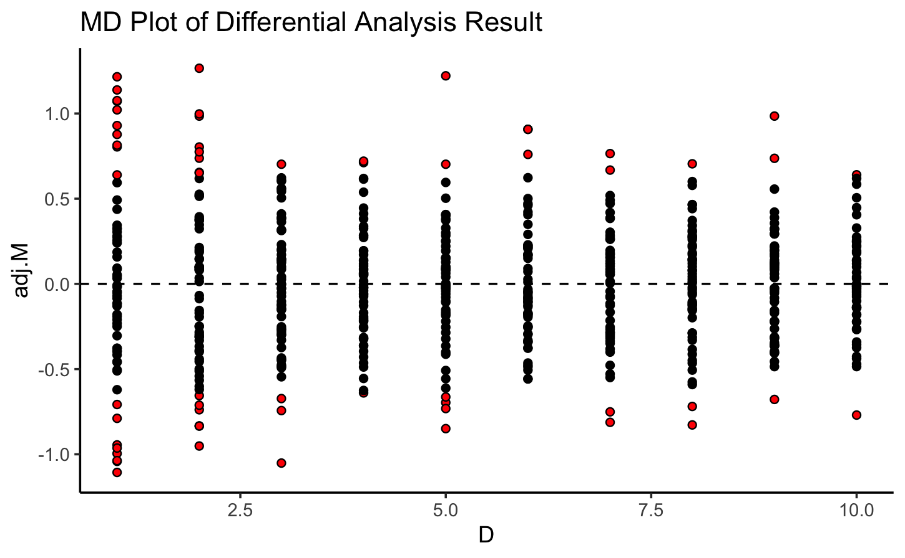
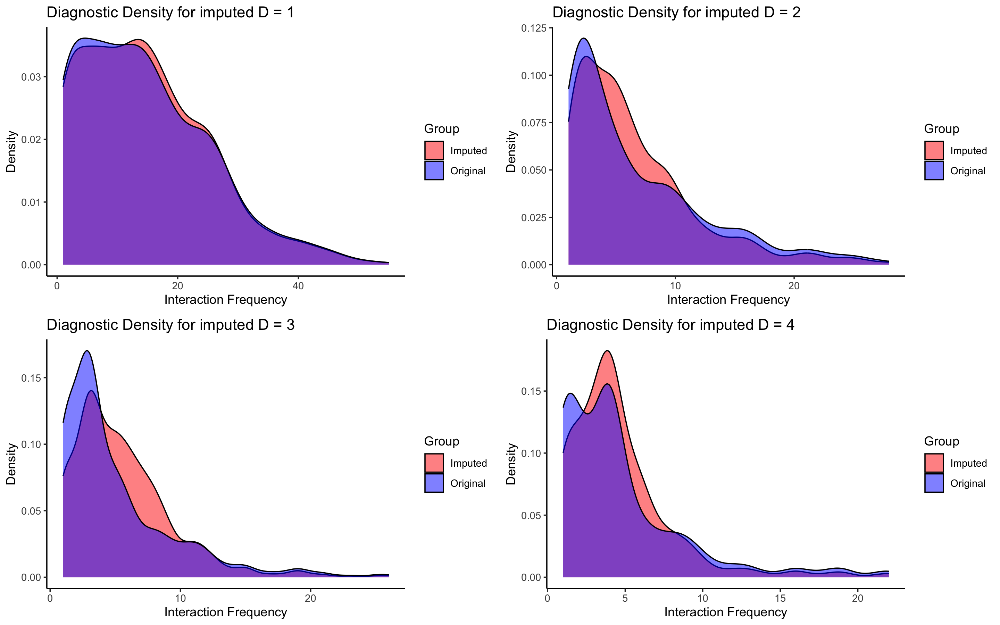
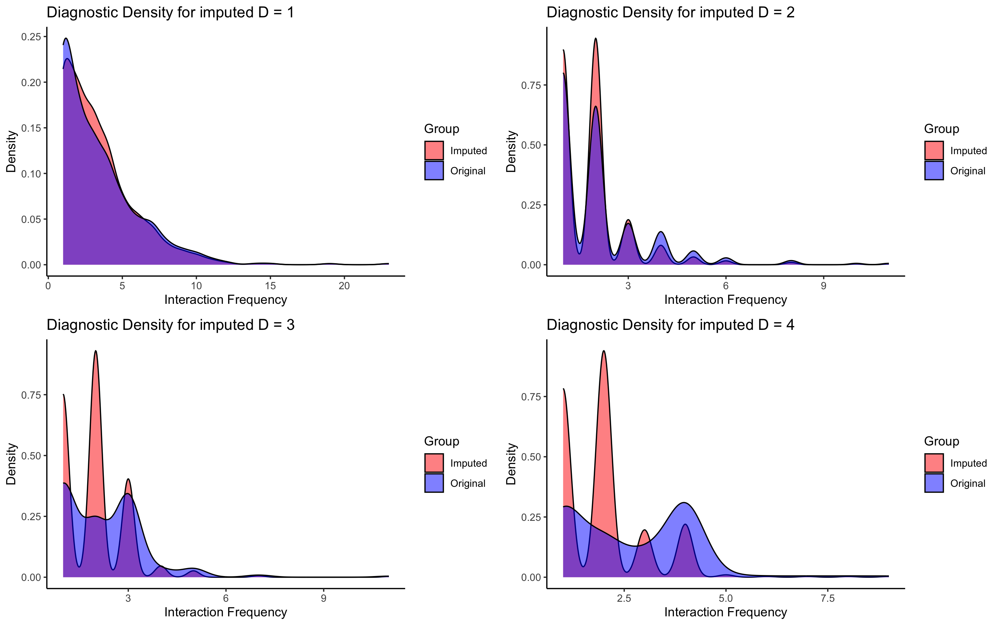

```{r setup, include=FALSE}
options(width = 1000)
knitr::opts_chunk$set(echo = TRUE)
# Set CRAN mirror
options(repos = c(CRAN = "https://cran.rstudio.com/"))

```

# Introduction

`ScHiCcompare` is package of functions designed for the imputation, joint normalization, and detection of differential chromatin interactions between two groups of single-cell Hi-C datasets (scHi-C). The groups can be pre-defined based on biological conditions or can be created by clustering single cells according to their chromatin interaction patterns. Clustering can be performed using methods like Higashi, scHiCcluster methods, etc. 

`ScHiCcompare` works with processed Hi-C data, specifically chromosome-specific chromatin interaction matrices, and accepts five-column tab-separated text files in a sparse matrix format. 

The package provides two key functionalities:

-   Imputation of single-cell Hi-C data
-   Differential analysis to identify differences in chromatin interactions between groups.


# Getting Start

## Installation

```{r, message=FALSE, warning=FALSE, eval = F}
if (!requireNamespace("BiocManager", quietly=TRUE))
   install.packages("BiocManager")

BiocManager::install("ScHiCcompare")

# For the latest version install from GitHub
# devtools::install_github("dozmorovlab/ScHiCcompare")
```

```{r,  message=FALSE, warning=FALSE, echo = F}
#devtools::install_github("dozmorovlab/ScHiCcompare", force = T)
```

```{r, message=FALSE, warning=FALSE}
library(data.table)
library(scHiCcompare)
library(tidyr)
library(ggplot2)
library(gridExtra)
library(lattice)

```

## Import schi-c data into R
To use ScHiCcompare, you'll need processed Hi-C data formatted as sparse upper triangular matrices in R, which consist of five columns: **chr1**, representing the chromosome of the first genomic locus; **start1**, the start position of the first genomic locus on chr1; **chr2**, the chromosome of the second genomic locus; **start2**, the start position of the second genomic locus on chr2; and **IF**, which stands for Interaction Frequency and represents the strength or frequency of chromatin interactions between the two loci. 

ScHi-C data is available in different formats from various sources. Below are two examples of how to download and extract chromosome-specific data for analysis in R.

If you have full Hi-C contact matrices, you can convert them to sparse upper triangular format using the `full2sparse()` function of `HiCcomapre` packge, then reformat the column to achieve the requirement input format.

#### Extracting data from .hic files

If you obtain data in the .hic format you will need to first extract the matrices that you wish to compare.

1.  Download the straw software from <https://github.com/theaidenlab/straw/wiki> and install it.
2.  Use straw to extract a Hi-C sparse upper triangular matrix. An example is below:

To extract a file scHiC.hic the raw matrix corresponding to chromosome 22 at the 500kb resolution we would use the following command within the terminal

`./straw NONE scHiC.hic  22 22 BP 500000 > scHiC.500kb.txt`

This will extract the matrix from the `.hic` file and save it to the `scHiC.500kb.txt` text file, in the sparse upper triangular matrix format. See more examples on how to use `straw` at <https://github.com/theaidenlab/straw/wiki/CPP#running>. Straw requires several inputs for the extraction of data from a `.hic` file.

`<NONE/VC/VC_SQRT/KR> <hicFile(s)> <chr1>[:x1:x2] <chr2>[:y1:y2] <BP/FRAG> <binsize>`

The first argument is the normalization method; for `ScHiCcompare`, choose `NONE` to use raw data. The second argument is the .hic file name. For intrachromosomal maps, set both chromosome numbers the same (`<chr1>` and `<chr2>` are interacting chromosome; `[:x1:x2]` are optional define specific genomic ranges within each chromosome).  Interchromosomal maps can use different chromosomes, but note that ScHiCcompare only handles intrachromosomal interactions. Choose `BP` for basepair data, and specify the bin size (e.g., 10000000 for 1MB resolution). Common bin sizes are 1MB, 500KB, 100KB, 50KB, 5KB, and 1KB. *Note that most matrices with resolutions higher than 10KB (i.e., matrices with resolutions of 1KB - 10KB) are typically too sparse for analysis in `ScHiCcompare`.*

From here we can import the matrix into R as you would normally for any tab-delimited file.

3.  Import the data into R `data <- read.table('scHiC.500kb.txt', header=FALSE)`
4.  Repeat these steps for all scHi-C dataset of 2 groups that you wish to compare.

#### Extracting data from .cool files

To use data in the .cool format, there are multiple ways to read these files. We are showing 2 examples of reading .cool files below:

-   Tools in R:

    The files can be read directly into R by ` `cooler2bedpe()` function of `HiCcompare`.

    The `cooler2bedpe()` functions will return a list object in the format of BEDPE, containing two elements: "cis" - Contains the intra-chromosomal contact matrices, one per chromosome; "trans" - Contains the inter-chromosomal contact matrix.

    An example of a scHiC.cool file being imported by `cooler2bedpe()` function is below. You can read about this in more detail by `?cooler2bedpe()`

    `library(HiCcompare)` 
    `cool.file <- read_files("path/to/scHiC.cool")`

-   Tools in Terminal of Mac/Linus or Command Prompt of Window

    The `cooler` software is one of software on Terminal of Mac/Linus or Command Prompt of Window that reads .cool file <http://cooler.readthedocs.io/en/latest/index.html>. The cooler index <ftp://cooler.csail.mit.edu/coolers> contains Hi-C data for `hg19` and `mm9` from many different sources. To read these file and transfer to R, you can follow these steps:

    1.  Download and install `cooler` from <http://cooler.readthedocs.io/en/latest/index.html>
    2.  Download a `.cool` file from the cooler index <ftp://cooler.csail.mit.edu/coolers>. 3.To extract the contact matrix we use the following commands in the terminal (scHiC.cool is an example .cool file):\
        `cooler dump -- scHiC.cool > scHiC.txt`
    3.  Read in the text file as you would any tab-delimited file in R\
        dataset \<- read.table("scHiC.txt", header = FALSE)\`
    4.  Repeat step 1 - 4 for single cell data.
    5.  Transfer these contact matrices of each single cell files into R by using `cooler2sparse()` of `HiCcomapre`:

    `sparse <- cooler2sparse(hesc1000kb)`

# ScHiCcompare function

### Overview

`ScHiCcompare()` function conducts a differential analysis workflow, including imputation and normalization, between chromosome-specific chromatin interaction matrices of two conditions (or two cell types groups). 

 - **Imputation** - First, scHiC data in each group can optionally undergo `imputation` to address sparsity, which arises from limitations and technical challenges. As resolution increases, the percentage of '0' values or missing data also rises drastically. To address this, scHiCompare applies the random forest (`RF`) imputation method to each pool band - data subsets (pooling technique), grouping the data based on similar effects of interacting genomic distances or their mean interaction frequencies (IFs) in each distance. There are two pooling styles: progressive pooling, in which each subsequent group combines more consecutive distances by gradually increasing the number of distances included by one; and `Fibonacci` pooling, where each group includes an increasing number of consecutive distances, with the number of distances in subsequent groups following the Fibonacci sequence. For any pool band with all of their distances elements outside the `main.Distance` range, if its percentage of missing values exceeds the `missPerc.threshold`, the missing interaction frequencies (IFs) values are imputed using the mean IF values from the available data within that pool band.

 - **Pseudo-bulk scHi-C** - Secondly, the processed (imputed( single-cell Hi-C will be transformed into `pseudo-bulk` scHi-C matrices by summing all of these single cell Hi-C matrices to generate pseudo-bulk matrices for each condition group.

 - **Normalization** - After obtaining two pseudo-bulk matrices for the condition groups, a `normalization` step is recommended to remove global and local biases between two pseudo-bulk matrices. The ScHiCompare workflow applies a loess regression model from `HiCcompare` to jointly normalize two imputed pseudo-bulk matrices. The data is visualized using a mean-difference (MD) plot, where \( M \) (calculated as \( M = \log_2(IF_2 / IF_1) \)) is plotted on the y-axis against \( D \), the distance between interacting regions. In this plot, a loess regression curve is fitted to adjust the interaction frequencies of the two condition groups, centering the \( M \) differences around a baseline of \( M = 0 \).

 - **Differential analysis** - Lastly, `differential analysis` is performed on the processed pseudo-bulk matrices to identify differential chromatin interactions between the two cell types or conditions. This involves clustering the normalized log fold changes of interaction frequencies into difference and non-difference groups. The non-difference group is assumed to follow a normal distribution centered around 0, identified using a Gaussian Mixture Model (GMM). The difference group consists of log fold changes belonging to other distributions clusters that deviate from the non-difference group's normal distribution. To improve the precision of difference group clustering, a control log fold change threshold `fprControl.logfc` is applied to difference cluster, excluding bins with low log fold change. In cases where the size of the differences are not large enough to form distinct distributions, these differences are assumed outliers of the normal distribution, which are identified by the differential analysis of `HiCcompare`.


### Input schi-c data format for `ScHiCcompare()`

To use ScHiCcompare, you'll need pre-defined groups and chromosome-specific scHi-C data in **.txt** and store single cell Hi-C data in a given folder path.

Each '.txt' data of a single-cell HiC should be formatted as sparse upper triangular matrices in R, which consist of four columns (chr, start1, start2, IF). Since the full matrix of chromatin interactions is symmetric, only the upper triangular portion, including the diagonal and excluding any 0, is stored as sparse matrix format. The required sparse matrix format of each single cell Hi-C is:

-   "chr" - a chromosome of first region
-   “start1” - a start coordinate (in bp) of the first region
-   “start2” - a start coordinate (in bp) of the second region
-   "IF" - the interaction frequency between 2 two regions (IFs)

The '.txt' files needs to be saved in tab-separated columns and no row names, column names, or quotes around character strings.

```{r, echo= FALSE}
data(MG_1)
MG_sparse <- MG_1[ ,c(1,2,4,5)] 
names(MG_sparse) <- c('chr' , 'start1', 'start2', 'IF')
DT::datatable(head(MG_sparse), options = list(pageLength = 6, dom = 'tip'),
              rownames = FALSE, width = 700)
```


### How to use ScHiCcompare() function

After preparing a `.txt` file for each scHiC dataset in sparse upper triangular format, you need to organize all the `.txt` files that belong to the same condition or cell type into a *folder*. These groups should be pre-defined based on criteria such as experimental conditions, clustering results, or biological characteristics. Before running `ScHiCcompare()`, you need two scHiC '.txt' files folders for two comparing condition/cell-type groups. 

```{r, eval=FALSE}
ScHiCcompare(file.path.1, file.path.2,
             select.chromosome, 
             main.Distances = 1:10000000,
             imputation = 'RF',
             normalization = 'Loess',
             differential.detect = 'MD.cluster',
             pool.style = 'progressive', fprControl.logfc = 0.8,  A.min = NULL, 
             save.output.path =  NULL, Plot = TRUE, Plot.normalize = FALSE, ...)
```

- *Required Input Parameter* :

  - `file.path.1, file.path.2` - Character string specifying the directory of folders containing scHi-C data for the first and second condition groups (cell-type groups).
  - `select.chromosome` -  Integer or character indicating the chromosome to be analyzed (e.g., 'chr1' or 'chrX'.) 
  - `main.Distances`- Numeric vector or character ('full') indicating the range (or full range) of interacting genomic distances (in base pairs) between two regions (e.g., loci or bins) to focus on. As the distance range and resolution increase, the percentage of '0' or missing values also increases. Selecting 'full' or a large distance range at high resolution (e.g., below 200kb) can make the function take longer to run due to extreme sparsity. Therefore, scHiCcompare is designed to focus on a range of 1 to 10MB by default.

- *Workflow Input Parameter*:

  - `imputation` - Character string or NULL of indicating the imputation method. Default is 'RF' for Random Forest imputation. If 'NULL' is select, the workflow will skip `imputation` step.
  - `normalization` - Character string or NULL indicating the normalization method. Default is 'Loess'.  If 'NULL' is select, the workflow will skip `normalization` step.
  - `pool.style` - Character string specifying the pooling style for `imputation`. Options are 'progressive' or 'Fibonacci'. Default is 'progressive'. If the `imputation` is skipped as NULL, the `pool.style` also should be NULL.
   - `fprControl.logfc` - A numeric value controlling the false positive rate of `differential.detect` step by setting the threshold for the log fold change in the 'difference' cluster. Detected differences identified by Gaussian Mixed Model (GMM) clusters only include values with log fold change that are larger than this threshold. Default is 0.8.
   - `A.min` - Numeric value or NULL that sets the A-value quantile cutoff for filtering low average interaction frequencies in the differential.detect step of the hic_compare() function from HiCcompare. This function detects outliers, considered "difference" bins when too few exist for GMM clustering. If not provided (NULL), an optimized minimum A threshold that maximizes MCC and TPR while minimizing FPR in the simulated Hi-C matrix.
  - `save.output.path` - Character string specifying the directory to save outputs, including the imputed cells in the form of a sparse upper triangular format, normalization result table, and differential analysis result table. If by defult, `save.output.path` = NULL, no files are saved.
  - `Plot` -  A logical value indicating whether to plot the `differential.dect` results in an MD plot. Default is TRUE.
  - `Plot.normalize` - A logical value indicating whether to plot the output of MD plot showing before/after loess `normalization`. Default is FALSE.
  - ...
  - For other detail, you cen look up `?ScHiCcompare()`
  

# Other functions

There are several other functions included in `ScHiCcompare` package. 

`plot_HiCmatrix_heatmap()` produces a heatmap visualization for HiC and scHiC matrices. It requires an input as a sparse matrix [Input schi-c data format for `ScHiCcompare()`](#Input-schi-c-data-format-for-`ScHiCcompare()`) with 3 column of. More information can be found in its help document and the example below.

```{r}
data("ODC_1")
ODC_1_plot.df <- ODC_1[ ,c(2,4,5)]
plot_HiCmatrix_heatmap(scHiC.sparse = ODC_1_plot.df, main = 'scHiC matrix of a ODC cell', zlim = c(0,5))
```


`plot_imputed_distance_diagnostic()` produces a visualization for imputation diagnostic of all single  at each genomic distsnce. It compare the distribution of a given distance data before and after imputation. It requires input of scHiC table of the original and imputed scHiC datasets. More information can be found in its help document and the example below [Imputation](#addfunc[??? needs link]).

```{r, warning=FALSE, message=FALSE}

## Original values before imputed 
# By scHiC_table(), which outputs scHiC table to input for the diagnostic plot
# scHiC.table_MG = scHiC_table(file.path  = path/to/MG/file,
#                              cell.type = 'MG', 
#                              select.chromosome = 'chr22')

data(scHiC.table_MG.chr22)

## Imputed values 
#  By Pooling_RF_impute(), which also outputs scHiC table object 
scHiC.table_imp.MG = Pooling_RF_impute(scHiC.table = scHiC.table_MG,
                                       n.imputation = 10,
                                       main.Distances = 1:10000000,
                                       pool.style = 'progressive')


plot_imputed_distance_diagnostic(org_sc_data = scHiC.table_MG,
                                 imp_sc_data = scHiC.table_imp.MG, D = 2)
```


# Example of scHiCompare workflow

Here is an example workflow using scHiC human brain datasets (Lee et al., 2019) with ODC and MG cell types at chromosome 20 with a 1MB resolution.


## Download and prepare input data

To download human brain datasets (Lee et al., 2019), we used the `download_schic()` function of package of `Bandnorm` to download the scHiC data of  ODC and MG cell types groups in 1MB resolution.

```{r, eval = FALSE}
### Install Bandnorm
install.packages(c('ggplot2', 'dplyr', 'data.table', 'Rtsne', 'umap'))

if (!requireNamespace("devtools", quietly=TRUE))
    install.packages("devtools")

library(devtools)
install_github("immunogenomics/harmony")

devtools::install_github('sshen82/BandNorm', build_vignettes = FALSE)
library(BandNorm)

### Download scHiC data of ODC and MG
download_schic("Lee2019", cell_type = 'ODC', cell_path ='ODCs_example')
download_schic("Lee2019", cell_type = 'MG', cell_path = 'MGs_example')

```


Since the size of scHiC data is large, we will only consider 10 single cells Hi-C data for each cell type groups. The function `Load_example_MGfolder()` and `Load_example_ODCfolder()` can generate the example folders containing 10 single cells examples of ODC and MG in the given path. The files follow the same format as those downloaded via `download_schic()`.


```{r}
## Load and create folder for example data - ODCs_example and MGs example folders
load_example_ODCfolder()
load_example_MGfolder()

## Below is the format of an example files
files_names = list.files('ODCs_example', full.names = T, recursive = T)
ex_format = read.table(files_names[1])
```

```{r, echo = T}
DT::datatable(head(ex_format), options = list(pageLength = 6, dom = 'tip'),
              rownames = FALSE, width = 700)
```

From the raw scHiC data above, we need to modify the files in each folder to the required sparse upper triangular matrix format (chr, start1, start2, IF) [Input schi-c data format for `ScHiCcompare()`](#Input-schi-c-data-format-for-`ScHiCcompare()`). 

```{r}
### Modify sparse upper triangular format

# Create a new directory 'mod_ODCs_example' to store the modified data for ODCs
dir.create('mod_ODCs_example', recursive = TRUE)
# Get the list of all files in the 'ODCs_example' folder
files_names = list.files('ODCs_example', full.names = TRUE, recursive = TRUE)

# Loop through each file in the list
for(i in 1:length(files_names)){
  # Read the data from the current file (in tab-delimited format)
  data = read.delim(files_names[i])
  modified.data = data[ ,c(1,2,4,5)]
  save.path = paste0('mod_ODCs_example/ODC_', i, '.txt')
  # Write the modified data to the specified file path 
  write.table(modified.data, save.path, sep = "\t", row.names = FALSE, col.names = FALSE, quote = FALSE)
}


# Create a new directory 'mod_MGs_example' to store the modified data for MGs
dir.create('mod_MGs_example', recursive = TRUE)
# Get the list of all files in the 'MGs_example' folder, with full paths
files_names = list.files('MGs_example', full.names = TRUE, recursive = TRUE)

# Loop through each file in the list
for(i in 1:length(files_names)){
  # Read the data from the current file (in tab-delimited format)
  data = read.delim(files_names[i])
  modified.data = data[ ,c(1,2,4,5)]
  save.path = paste0('mod_MGs_example/MG_', i, '.txt')
  # Write the modified data to the specified file path 
  write.table(modified.data, save.path, sep = "\t", row.names = FALSE, col.names = FALSE, quote = FALSE)
}

```


## ScHiCompare

In this example, we will work with scHi-C data from 10 single cells in both ODC and MG cell types. We will focus on chromosome 20, applying the full workflow of scHiCcompare (imputation, speudo-bulk normalization, and differential analysis) . We focus to detect differences for loci with genomic distances from 1 to 10,000,000 (bp). The progressive pooling style is selected to create pool bands for the random forest imputation. For differential analysis step, we set the log fold change - false positive control threshold as 0.8.

```{r, message=FALSE, warning=FALSE, eval = F}
## Imputation with 'progressive' pooling
result = ScHiCcompare(file.path.1 = 'mod_ODCs_example', file.path.2 = 'mod_MGs_example',
             select.chromosome = 'chr20', 
             main.Distances = 1:10000000,
             imputation = 'RF',
             normalization = 'Loess',
             differential.detect = 'MD.cluster',
             pool.style = 'progressive', fprControl.logfc = 0.8, 
             Plot = TRUE, Plot.normalize = TRUE)

```





From the visualizations above, normalization effectively reduces the fuzziness between the imputed pseudo-bulk data of the two cell types. At a 1MB resolution, the differential analysis reveals that most of the detected differences occur at closer genomic distances, particularly below 5MB.

We can extract the differential result in `$Differential_Analysis`, imputed results in `$Intermediate$Imputation`, and normalization result in `$Intermediate$Bulk.Normalization`

```{r, echo = F}
data(result)
```

```{r}
### Extract imputed ODC cell type table
imp_ODC_table = result$Intermediate$Imputation$condition1

```

```{r, echo = F}
DT::datatable(head(imp_ODC_table), options = list(scrollX = TRUE), width = 700)
```

```{r}
### Extract imputed pseudo bulk matrices normalization
norm_result = result$Intermediate$Bulk.Normalization
```

```{r, echo = F}

DT::datatable(head(norm_result), options = list(scrollX = TRUE), width = 700)
```

The imputation can be further evaluated using the `plot_imputed_distance_diagnostic()` function, which compares the overall distribution of original and imputed interaction frequencies (IFs) across all tested single cells within a specified genomic distance range. This function requires input in the form of data frames for both the original and imputed IFs. Each data frame must include columns for region1, region2, Cell, Chr, and IF_i for each of the i single cells.

The output of `$Intermediate$Imputation` of `ScHiCcompare()` function has achieved this format of input table. We need to create the table for original IFs values in the same format. This job can be done simply by `scHiC_table()` function. You can see detail of this function by looking up `?scHiC_table()`.


```{r, message=FALSE, warning=FALSE, eval = F}
# Create scHiC table object for original IF
scHiC.table_ODC = scHiC_table(file.path = 'mod_ODCs_example', cell.type = 'ODC', select.chromosome = 'chr20')
scHiC.table_MG = scHiC_table(file.path = 'mod_MGs_example', cell.type = 'MG', select.chromosome = 'chr20')

# Extract imputed table result 
imp_MG_table = result$Intermediate$Imputation$condition2
imp_ODC_table = result$Intermediate$Imputation$condition1

# plot imputed Distance Diagnostic of MG
plot1 = plot_imputed_distance_diagnostic(org_sc_data = scHiC.table_MG,
                                         imp_sc_data = imp_MG_table, D = 1)
plot2 = plot_imputed_distance_diagnostic(org_sc_data = scHiC.table_MG,
                                         imp_sc_data = imp_MG_table, D = 2)
plot3 = plot_imputed_distance_diagnostic(org_sc_data = scHiC.table_MG,
                                         imp_sc_data = imp_MG_table, D = 3)
plot4 = plot_imputed_distance_diagnostic(org_sc_data = scHiC.table_MG,
                                         imp_sc_data = imp_MG_table, D = 4)
grid.arrange(plot1, plot2, plot3, plot4, ncol = 2, nrow =2)

```



```{r, eval=FALSE}

# plot imputed Distance Diagnostic of ODC
plot5 = plot_imputed_distance_diagnostic(org_sc_data = scHiC.table_ODC,
                                         imp_sc_data = imp_ODC_table, D = 1)
plot6 = plot_imputed_distance_diagnostic(org_sc_data = scHiC.table_ODC,
                                         imp_sc_data = imp_ODC_table, D = 2)
plot7 = plot_imputed_distance_diagnostic(org_sc_data = scHiC.table_ODC,
                                         imp_sc_data = imp_ODC_table, D = 3)
plot8 = plot_imputed_distance_diagnostic(org_sc_data = scHiC.table_ODC,
                                         imp_sc_data = imp_ODC_table, D = 4)
grid.arrange(plot5, plot6, plot7, plot8, ncol = 2, nrow =2)
```



The diagnostic visualizations show that for MG, the imputed values closely match the original interaction frequency (IF) distributions across most genomic distances. However, with only 10 single cells per group, the imputed values for ODC perform well only at closer genomic distances (e.g., D1, D2). The accuracy of the imputation can be further improved by increasing the number of single cells in each group. The scHiCcompare paper recommends using at least 60 single cells per group for optimal imputation accuracy.

# Session Info

```{r, echo=FALSE}
sessionInfo()
```
