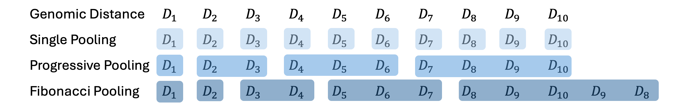

```{r setup, include=FALSE}
options(width = 1000)
knitr::opts_chunk$set(echo = TRUE)
# Set CRAN mirror
options(repos = c(CRAN = "https://cran.rstudio.com/"))

#BiocManager::install("BiocStyle")
library(BiocStyle)
```

# Introduction

`r BiocStyle::Biocpkg("scHiCcompare")` is designed for the imputation, joint normalization, and detection of differential chromatin interactions between two groups of chromosome-specific single-cell Hi-C datasets (scHi-C). The groups can be pre-defined based on biological conditions or can be created by clustering single-cells according to their chromatin interaction patterns. Clustering can be performed using methods like [Higashi](https://github.com/ma-compbio/Higashi), [scHiCcluster](https://github.com/zhoujt1994/scHiCluster) methods, etc. 

`r BiocStyle::Biocpkg("scHiCcompare")` works with processed Hi-C data, specifically chromosome-specific chromatin interaction matrices, and accepts five-column tab-separated text files in a sparse matrix format. 

The package provides two key functionalities:

-   Imputation of single-cell Hi-C data by random forest model with pooling technique
-   Differential analysis to identify differences in chromatin interactions between groups.

# Installation

```{r, message=FALSE, warning=FALSE, eval=FALSE}
if (!requireNamespace("BiocManager", quietly=TRUE))
   install.packages("BiocManager")

BiocManager::install("scHiCcompare")

# For the latest version install from GitHub
# devtools::install_github("dozmorovlab/scHiCcompare")
```

```{r,  message=FALSE, warning=FALSE, echo=FALSE}
#devtools::install_github("dozmorovlab/scHiCcompare", force = T)
```

```{r, message=FALSE, warning=FALSE}
library(scHiCcompare)
library(tidyr)
library(ggplot2)
library(gridExtra)
library(lattice)
library(data.table)
```

# scHiCcompare function

## Overview

`scHiCcompare()` function conducts a differential analysis workflow, including imputation and normalization, using chromosome-specific chromatin interaction matrices split into two conditions (or two cell types groups). 

 - **Imputation** - First, scHiC data in each group can optionally undergo `imputation` to address data sparsity. As resolution increases, the percentage of '0' values or missing data also rises drastically. To address this, scHiCompare applies the random forest (`RF`) imputation method on each genomic distance (`no pooling`) or pooled bands with option of pooling technique. There are two pooling strategies:

    1. `Progressive pooling`, where each subsequent band combines interaction frequencies (IFs) within linearly increasing range of distances.
    
    2. `Fibonacci pooling`, where each subsequent band combines IFs within increasing distance ranges, and this increase follows the Fibonacci sequence.
    
```{r, echo=FALSE, out.width="100%", fig.cap="An example of how different pooling style assign genomic distance into each band", fig.align="center"}

```


Due to extreme sparsity at higher genomic distance and randomness of long-range interactions, scHiCcompare, by default, workflow focuses on distance range 1 to 10MB (`main.Distance`).  If any pool band falls outside this range and has a percentage of missing values exceeding the specified threshold (default missPerc.threshold is 95%), the missing interaction frequencies (IFs) values are imputed using the mean IF values from the available data within that pool band.

 - **Pseudo-bulk scHi-C** - Second, imputed single-cell Hi-C data in each group are transformed into group-specific `pseudo-bulk` scHi-C matrices by summing all group-specific single-cell Hi-C matrices.

 - **Normalization** - After obtaining two group-specific pseudo-bulk matrices, `normalization` removes global and local biases between two pseudo-bulk matrices. The `r BiocStyle::Biocpkg("scHiCcompare")` workflow applies a LOESS  regression model from `r BiocStyle::Biocpkg("HiCcompare")` to jointly normalize two imputed pseudo-bulk matrices. Briefly,
    + The data is visualized using a mean-difference (MD) plot, where \( M \), **M**ean difference (calculated as \( M = \log_2(IF_2 / IF_1) \), Y-axis) is plotted against \( D \), the **D**istance between interacting regions (X-axis). In this plot, a LOESS regression curve is fitted to adjust the interaction frequencies of the two condition groups, centering the \( M \) differences around a baseline of \( M = 0 \).

 - **Differential analysis** - `differential analysis` is performed on the processed pseudo-bulk matrices to identify differential chromatin interactions between the two cell types or conditions. This involves separating the normalized log fold changes of interaction frequencies (the M-values) into difference and non-difference groups. This analysis is performed on per-distance basis.
    + The non-difference group is assumed to follow a normal distribution centered around 0, identified using a Gaussian Mixture Model (GMM). The difference group consists of log fold changes belonging to other distributions that deviate from the non-difference group's normal distribution. To improve precision, a log fold change threshold `fprControl.logfc` is applied to values in the difference group, excluding low log fold changes.
    + When the differences are not large enough to form distinct distributions, the default differential analysis of `r BiocStyle::Biocpkg("HiCcompare")` is used.

## Input 

To use scHiCcompare, you'll need to define two groups of cells to compare and save cell-specific scHi-C data (individual files in **.txt** format) in two folders.

Each cell-specific scHi-C **.txt** file should be formatted as modified sparse upper triangular matrices in R, which consist of five columns (chr1, start1, chr2, start2, IF). Since the full matrix of chromatin interactions is symmetric, only the upper triangular portion, including the diagonal and excluding any 0, is stored as sparse matrix format. The required sparse matrix format of each single-cell Hi-C is: 

-   "chr1" - Chromosome of the first region. 
-   “start1” - a start coordinate (in bp) of the first region.
-   "chr2" - Chromosome of the second region.
-   “start2” - a start coordinate (in bp) of the second region.
-   "IF" - the interaction frequency between 2 two regions (IFs).

The '.txt' files needs to be saved in tab-separated columns and no row names, column names, or quotes around character strings with example format below.


```{r, echo=FALSE}
data("ODC.bandnorm_chr20_1") 
```

```{r, echo=FALSE}
names(ODC.bandnorm_chr20_1) <- c('chr1' , 'start1', 'chr2','start2', 'IF') 
DT::datatable(head(ODC.bandnorm_chr20_1), options = list(pageLength = 6, dom = 'tip'),
              rownames = FALSE, width = 700)
```

To run `scHiCcompare()`, you need two folders with condition-specific scHiC '.txt' files. The condition-specific groups of cells should be pre-defined based on criteria such as experimental conditions, clustering results, or biological characteristics. 

Below is examples of steps to download and import scHi-C data into R. Then you can modify the data the format to prepare for the input.

### Download scHiC data

  To find and download single-cell Hi-C (scHi-C) data, you can use publicly available repositories and databases that host this type of data. Common sources include the Gene Expression Omnibus (GEO), the 4D Nucleome Data Portal (4DN), or data published in research articles, etc. Below are some examples of how to access and download scHi-C data.
  
  - **[GEO](#https://www.ncbi.nlm.nih.gov/geo/) (Gene Expression Omnibus)**:
  
  You can search data on [GEO](#https://www.ncbi.nlm.nih.gov/geo/) using queries such as `single-cell Hi-C` , `scHi-C`, or a GEO (GSE) series numbers (e.g., [GSE80006](#https://www.ncbi.nlm.nih.gov/geo/query/acc.cgi?acc=GSE80006)), etc. Once you select a dataset, processed data  (.txt, .csv, .bed, .hic, etc.)  can be found under the "Supplementary files" section and downloaded via `FTP` links at the bottom of the page. Additionally, [GEO](#https://www.ncbi.nlm.nih.gov/geo/) offers various download formats using different mechanisms. For more details about downloading data in different formats, visit the GEO download guide: <https://www.ncbi.nlm.nih.gov/geo/info/download.html>.
  
  You can also download these data by R. Example below show steps to download mouse scHi-C dataset (Flyamer et al.2017) on [GEO](#https://www.ncbi.nlm.nih.gov/geo/).
  
```{r, eval=FALSE}
if (!requireNamespace("BiocManager", quietly = TRUE))
    install.packages("BiocManager")

BiocManager::install("GEOquery")
```
  
```{r, eval=FALSE}
# For example, we want to download (Flyamer et al.2017) data
geo_id <- "GSE80006"
# Download the information, notation, feature data, etc
gse <- getGEO(geo_id, GSEMatrix = TRUE)
# You can read more about this function 
?getGEO()

# Download and extract the supplementary files (processed data)
getGEOSuppFiles(geo_id, baseDir = "path/to/save")
```
    
**Other sources**:
  
  Some research papers provides data in external sources, which usually be mentioned in the paper. For example, human brain datasets (Lee et al., 2019) is aviable through a public box directory located <https://salkinstitute.box.com/s/fp63a4j36m5k255dhje3zcj5kfuzkyj1>.
  
  Additionally, some tools collect scHi-C data from various studies, like  <https://noble.gs.washington.edu/proj/schic-topic-model/>. Below is example of a R function from `r BiocStyle::Biocpkg("Bandnorm")`, which also access existing single-cell Hi-C data at 1mb resolution 

  To download human brain oligodendrocytes (ODC) and microglia (MG) cell type (Lee et al., 2019), we used the `download_schic()` function of `r BiocStyle::Biocpkg("Bandnorm")` package to download the scHiC data of  ODC and MG cell types groups in 1MB resolution.

```{r, eval=FALSE}
### Install Bandnorm
install.packages(c('ggplot2', 'dplyr', 'data.table', 'Rtsne', 'umap'))

if (!requireNamespace("devtools", quietly=TRUE))
    install.packages("devtools")

devtools::install_github("immunogenomics/harmony")

devtools::install_github('sshen82/BandNorm', build_vignettes = FALSE)
library(BandNorm)
```

```{r, eval=FALSE}
### Download scHiC data of ODC and MG
download_schic("Lee2019", cell_type = 'ODC', cell_path ='ODCs_example')
download_schic("Lee2019", cell_type = 'MG', cell_path = 'MGs_example')
```

### Import scHiC data in R

After downloading scHi-C data, the next step is to import the data into R for analysis.

ScHi-C data is available in various formats from different sources. Below are examples of how to extract chromosome-specific data for analysis in R.

  - **`.bedepe, .csv, or .txt` formats** : 
  
If your raw scHiC data has been processed to '.bedepe', '.csv', or '.txt' formats, it can be read using `read.delim()`, `read.table()`, etc. Once the data is loaded, if you have full Hi-C contact matrices, you can convert them to sparse upper triangular format using the `full2sparse()` function of `r BiocStyle::Biocpkg("HiCcompare")` packge, then reformatting the columns to achieve the sparse upper triangular [input](#input) format.

  - **`.hic` format**:  
  
To access and import `.hic` files into R, you can use tools such as `r BiocStyle::Biocpkg("strawr")` for reading and processing `.hic` files. You can read other similar example in `r BiocStyle::Biocpkg("HiCcompare")` packge [vignette](https://www.bioconductor.org/packages/release/bioc/vignettes/HiCcompare/inst/doc/HiCcompare-vignette.html)

Example of reading `.hic` by `r BiocStyle::Biocpkg("strawr")` is shown below. By using `straw()`, it reads the `.hic` file of each single-cell Hi-C and outputs as data.frame in sparse upper triangular format. You need to repeat (loop) this step for single-cell Hi-C of a same cell type (condition) group.
    
```{r, eval=FALSE}
if (!requireNamespace("BiocManager", quietly = TRUE))
    install.packages("BiocManager")
BiocManager::install("strawr")
```

```{r, eval=FALSE}
library(strawr)

# Example to read the contact matrix from a .hic file of a single-cell
filepath <- "path/to/your/schic.hic"

contact_matrix <- straw(
    norm = "NONE",          # Normalization method (KR, VC, or NONE)
    filepath,               # Path to .hic file
    chr1loc = "chr1",       # Chromosome 1
    chr2loc  = "chr1",       # Chromosome 2 (same with chromosome 1 for intra-chromosomal interactions)
    unit = "BP",            # Base pair (BP) resolution or fragment (FRAG) resolution
    binsize = 200000        # Bin size (e.g., 200kb)
)
```

  - **`.cool` format**:  
  
To access and import `.cool` files into R,  you can use `cooler2bedpe()` function of `r BiocStyle::Biocpkg("HiCcompare")` package or [cooler](#<http://cooler.readthedocs.io/en/latest/index.html>) to access the data. You can read example of [cooler](#<http://cooler.readthedocs.io/en/latest/index.html>) on  `r BiocStyle::Biocpkg("HiCcompare")` [vignette](https://www.bioconductor.org/packages/release/bioc/vignettes/HiCcompare/inst/doc/HiCcompare-vignette.html)

For example, the files can be read directly into R by `cooler2bedpe()` function, which will return a list object in the format of BEDPE, containing two elements: "cis" - Contains the intra-chromosomal contact matrices, one per chromosome; "trans" - Contains the inter-chromosomal contact matrix. You can read about this in more detail by `?cooler2bedpe()`.
  
```{r, eval=FALSE}
if (!requireNamespace("BiocManager", quietly=TRUE))
    install.packages("BiocManager")
BiocManager::install("HiCcompare")
library(HiCcompare)
```

```{r, eval=FALSE}
cool.file <- read_files("path/to/schic.cool")
```


### Prepare input folders

Here is an example workflow using scHiC human brain datasets (Lee et al., 2019) with ODC and MG cell types at chromosome 20 with a 1MB resolution.

For the following example sections, we will load samples of 10 single-cells Hi-C data (in '.txt') for each cell type groups in two example folders (`ODCs_example` and `MGs_axample`). The files follow the same format as those downloaded via `download_schic()` of `r BiocStyle::Biocpkg("Bandnorm")`. You can extract the folder path by the code below, which could be used as input for `scHiCcompare()` function.

```{r}
## Load folder of ODC file path
ODCs_example_path <- system.file("ODCs_example", package = "scHiCcompare")

## Load folder of MG file path
MGs_example_path <- system.file("MGs_example", package = "scHiCcompare")
```

Since the data downloaded by `r BiocStyle::Biocpkg("Bandnorm")` has the required input format (5 columns of [chr1, start1, chr2, start2, IF]), we don't need extra step for data modification. If, after importing your data into R, its format does not follow sparse upper triangular [input](#input) format requirement, you need to modify the data.

## scHiCcompare function

The function requires two *Input Parameter*: 

- `file.path.1, file.path.2` - Character strings specifying paths to folders containing scHi-C data for the first and second cell type or condition groups.
- `select.chromosome` -  Integer or character indicating the chromosome to be analyzed (e.g., 'chr1' or 'chr10'.) 


```{r, eval=FALSE}
scHiCcompare(file.path.1, file.path.2,
             select.chromosome, 
             main.Distances = 1:10000000,
             imputation = 'RF',
             normalization = 'LOESS',
             differential.detect = 'MD.cluster',
             pool.style = 'progressive' , n.imputation = 5,
             maxit = 1, outlier.rm = TRUE, missPerc.threshold = 95,
             A.min = NULL, fprControl.logfc = 0.8, alpha = 0.05,
             Plot = T, Plot.normalize = F, save.output.path =  NULL)
```

*Optional Workflow Parameter* include:

- `main.Distances` - A numeric vector indicating the range of interacting genomic distances (in base pairs) between two regions (e.g., loci or bins) to focus on (e.g., `1:100000`, `Inf`). All genomic range selections can be specified using `Inf`. The `main.Distances` vector should be proportional to the data’s resolution (e.g., for 10kb resolution: `1:10000`, `1:50000`, `1:100000`, `Inf`). As the distance range and resolution increase, the percentage of '0' or missing values also increases. Selecting a large distance range at high resolution (e.g., below 200kb) may increase runtime due to extreme sparsity. By default, `main.Distances` = `1:10000000`.

- `imputation` - A character string, either `'RF'` or `NULL`, indicating the imputation method. If `NULL` is selected, the workflow will skip the `imputation` step. The default is `'RF'` for Random Forest imputation.

- `normalization` - A character string, either `'LOESS'` or `NULL`, indicating the normalization method. If `NULL` is selected, the workflow will skip the `normalization` step. The default is `'LOESS'`.


*Optional Imputation Parameter* include:

- `pool.style` - A character string specifying the pooling style for `imputation`. Options are `'none'`, `'progressive'`, or `'Fibonacci'`. The default is `'progressive'`.

- `n.imputation` - An integer specifying the number of multiple imputations for the imputation step. Because the final imputed values are calculated as the average of multiple imputations, increasing the number of imputations improves the accuracy of imputed values; however, it may also extend the imputation runtime. The default is `5`.

- `maxit` - An integer specifying the maximum number of iterations for the internal refinement process within a single `imputation` cycle. Increasing `maxit` can help stabilize imputed values, although it may increase the imputation runtime. The default is `1`.

- `outlier.rm` - Logical. If `TRUE`, outliers are removed during `imputation`. The default is `TRUE`.

- `missPerc.threshold` - A numeric value specifying the maximum allowable percentage of missing data in pool bands outside the `main.Distances` to be imputed by the `imputation` method. A higher threshold includes more extreme sparse distances for imputation (e.g., above 95 percent), which increases memory and runtime, while a lower threshold (e.g., below 50 percent) might reduce the number of distances imputed. The default is `95`.


*Optional Normalization Parameter* include:

- `A.min` - Numeric value or NULL that sets the A-value quantile cutoff (eg,. 7, 10, etc) for filtering low average interaction frequencies in the outlier detection in differential step of the `hic_compare()` function from `r BiocStyle::Biocpkg("HiCcompare")`.  If not provided (NULL), A is auto-detected.

*Optional Differential Test Parameter* include:

- `fprControl.logfc` - Numeric value to control the false positive rate for GMM difference clusters (`differential.detect`) (e.g., 0.5, 0.8, 1, 1.5, etc.). Increasing `fprControl.logfc` may lower the false positive rate but may also reduce the number of detected chromatin interaction differences. The default is 0.8, equivalent to a 2-fold change.

- `alpha` - Numeric value specifying the significance level for outlier detection during the `differential.detect` step with the `hic_compare()` function from HiCcompare. Default is 0.05.


*Optional Output Parameter* :

- `save.output.path` - Character string specifying the directory to save outputs, including the imputed cells in the form of a sparse upper triangular format, normalization result table, and differential analysis result table. If `save.output.path` = NULL (the default), no files are saved. 

- `Plot` -  A logical value indicating whether to plot the `differential.detect` results in an MD plot. Default is TRUE.

- `Plot.normalize` - A logical value indicating whether to plot the output of MD plot showing before/after LOESS `normalization`. Default is FALSE.


### Example of real anlysis

In this following example, we will work with scHi-C data from 10 single cells in both ODC and MG cell types at a 1 MG resolution. We will focus on chromosome 20, applying the full workflow of scHiCcompare, which includes imputation, pseudo-bulk normalization, and differential analysis. Our goal is to detect differences for loci with genomic distances ranging from 1 to 10,000,000 bp. The progressive pooling style will be selected to create pool bands for the random forest imputation. For the differential analysis step, we will set the log fold change - false positive control threshold to 0.8.


The input file path was included in the package and conducted in [Prepare input folders](#prepare-input-folders) section.


```{r, message=FALSE, warning=FALSE}
## Imputation with 'progressive' pooling
result = scHiCcompare(file.path.1 = ODCs_example_path, 
                      file.path.2 = MGs_example_path,
                      select.chromosome = 'chr20', 
                      main.Distances = 1:10000000,
                      imputation = 'RF',
                      normalization = 'LOESS',
                      differential.detect = 'MD.cluster',
                      pool.style = 'progressive', 
                      fprControl.logfc = 0.8, 
                      Plot = TRUE, 
                      Plot.normalize = TRUE)

```

From the visualizations above, normalization effectively reduces the irregular trend in the M values between the imputed pseudo-bulk matrices of the two cell types. At a 1MB resolution, the differential analysis reveals that most of the detected differences occur at closer genomic distances, particularly below 5MB.


## Output

#### Output objects from R function

The `scHiCcompare()` function will return an object that contains plots, differential results, pseudo-bulk matrices, normalized results, and imputation tables. The full differential result are available in in `$Differential_Analysis`. Intermediate results can be accessed with `$Intermediate`, including imputation result table (`$Intermediate$Imputation`), speudo-bulk matrix in sparse format (`$Intermediate$PseudoBulk`), and normalization table (`$Intermediate$Bulk.Normalization`). These output tables objects have following structure:

  - `$Intermediate$PseudoBulk` for each condition group (`$condition1` and `$condition2`) has standard sparse upper triangular format with 3 columns of [region1, region2, IF].
  
  - `$Intermediate$Imputation`  for each condition group (`$condition1` and `$condition2`) has modified sparse upper triangular format:
  
    + Interacting bins coordination [region1, region2, cell (condition 1 or condition2), chr]
    + Imputed interaction frequency of each single-cell [imp.IF_{cell name 1}, imp.IF_{cell name 2}, imp.IF_{cell name 3}, ...,etc]

  - `$Intermediate$Bulk.Normalization` has 15 columns
    + Interacting bins coordination [chr1, start1, end1, chr2, start2, end2, D (scaled genomic distance)]
    + Bulk IF values [bulk.IF1, bulk.IF2, M (their log fold change, $log(IF_2/IF_1)$)]
    + Normalized bulk IF values [adj.bulk.IF1, adj.bulk.IF2, adj.M (their log fold change, $log(adj.IF_2/adj.IF_1)$)]
    + LOESS correction factor [mc];
    + Average expression value of bulk IF [A].
    
  - `$Differential_Analysis` has same structure as `$Intermediate$Bulk.Normalization` with addition of 2 differential detection results columns
    + Z score of interaction frequencies's log fold change [Z]
    + Differential result cluster [Difference.cluster]
    

#### External saved output files

You also can have option to save the results into chosen directory by parameter in `scHiCcompare()` [function](#schiccompare-function). This will save normalization result table, differential result table, and imputed cell scHi-C data (each group is a sub-folder). The sample of saved output folder structure is:
 
        + Bulk_normalization_table.txt
        + Differential_analysis_table.txt
        + Imputed_{group 1's name}
          └── + imp_{cell name}.txt
        + Imputed_{group 2's name} 
          └── + imp_{cell name}.txt 

Normalization result `Bulk_normalization_table.txt` has the same format as output object from `scHiCcompare()` function, `$Intermediate$Bulk.Normalization`, which is shown structure example below. 
  
Differential result table `Differential_analysis_table.txt` also has same format as output object `$Differential_Analysis` from the function.

Imputed cell's scHiC data is saved in folder for each group, which has modified sparse upper triangular format of five columns [chr1, start1, chr2, start2, IF].


### Example of output

Below is continuous example from [Example of real anlysis](#example-of-real-anlysis) above, showing how you can extract different result option from the `scHiCcompare()` function.

```{r}
### Extract imputed differential result
diff_result = result$Differential_Analysis
DT::datatable(head(diff_result), options = list(scrollX = TRUE), width = 700)
```

```{r}
### Extract imputed pseudo bulk matrices normalization
norm_result = result$Intermediate$Bulk.Normalization
DT::datatable(head(norm_result), options = list(scrollX = TRUE), width = 700)
```

```{r}
### Extract imputed ODC cell type table
imp_ODC_table = result$Intermediate$Imputation$condition1
DT::datatable(head(imp_ODC_table), options = list(scrollX = TRUE), width = 700)
```

```{r}
## Extract Pseudo-bulk matrix from imputed scHi-C data
## Pseudo bulk matrix in standard sparse format
psudobulk_result = result$Intermediate$PseudoBulk$condition1
DT::datatable(head(psudobulk_result), options = list(scrollX = TRUE), width = 700)
```

Furthermore, you also have some parameter options in the function to indicate which plots to output and option to save the results in given directory.


# Helper functions

There are several other functions included in `scHiCcompare` package. 

## Heatmap HiC matrix plot
`plot_HiCmatrix_heatmap()` produces a heatmap visualization for HiC and scHiC matrices. It requires an input as a modified sparse matrix, same format of `scHiCcompare()` [Input](#input) with five columns of chr1, start1, chr2 start2, IF. More information can be found in its help document and the example below.

```{r}
data("ODC.bandnorm_chr20_1")
plot_HiCmatrix_heatmap(scHiC.sparse = ODC.bandnorm_chr20_1, main = 'scHiC matrix of a ODC cell', zlim = c(0,5))
```


## Imputation Diagnostic plot
`plot_imputed_distance_diagnostic()` generates a diagnostic visualization of imputation across genomic distances for all single cells. It compares the distribution of all single-cell's interaction frequency at a given distance data before and after imputation. It requires input of scHiC table format of the original and imputed scHiC datasets. ScHiC table format includes columns of genomic loci coordinates and interaction frequencies (IF) of each single-cell (cell, chromosome, start1, end1, IF1, IF2, IF3, etc). 

The output of `$Intermediate$Imputation` of `scHiCcompare()` function is directly compatible with this format. For more details, see the sections on [Output](#output))


```{r, message=FALSE, warning=FALSE}
# Extract imputed table result 
imp_MG_table = result$Intermediate$Imputation$condition2
imp_ODC_table = result$Intermediate$Imputation$condition1
```

```{r, echo=FALSE}
DT::datatable(imp_ODC_table, options = list(scrollX = TRUE), width = 700)
```

We need to create the table input for original IFs values in the same format. Below is continuous example from [Example of real anlysis](#example-of-real-anlysis) above, showing how you can construct scHiC table for original IF values and compare them with the output of imputed IF values.

```{r, message=FALSE, warning=FALSE}
# Create scHiC table object for original ODC interaction frequencies (IF)
scHiC.table_ODC = imp_ODC_table[c('region1', 'region2', 'cell', 'chr')] 

# List all files in the specified directory for original ODC data
file.names = list.files(path = ODCs_example_path, full.names = TRUE, recursive = TRUE)

# Loop through each file to read and merge data
for(i in 1:length(file.names)) {
  # Read the current file into a data frame
  data = read.delim(file.names[[i]])
  names(data) = c('chr', 'region1', 'chr2', 'region2', paste0('IF_',i))
  data = data[ ,names(data) %in% 
                c('chr','region1', 'region2', paste0('IF_',i))]
  # Merge the newly read data with the existing scHiC.table_ODC 
  scHiC.table_ODC = merge(scHiC.table_ODC, data,
                          by = c('region1', 'region2', 'chr'), all = TRUE)
}


# Create scHiC table object for original MG interaction frequencies (IF)
scHiC.table_MG = imp_MG_table[c('region1', 'region2', 'cell', 'chr')] 
# List all files in the specified directory for original MG data
file.names = list.files(path = MGs_example_path, full.names = TRUE, recursive = TRUE)

# Loop through each file to read and merge data
for(i in 1:length(file.names)) {
  # Read the current file into a data frame
  data = read.delim(file.names[[i]])
  names(data) = c('chr', 'region1', 'chr2', 'region2', paste0('IF_',i))
  data = data[ ,names(data) %in% 
                c('chr','region1', 'region2', paste0('IF_',i))]
  # Merge the newly read data with the existing scHiC.table_MG 
  scHiC.table_MG = merge(scHiC.table_MG, data,
                          by = c('region1', 'region2', 'chr'), all = TRUE)
}

```

```{r, message=FALSE, warning=FALSE}
# plot imputed Distance Diagnostic of MG
plot1 = plot_imputed_distance_diagnostic(raw_sc_data = scHiC.table_MG,
                                         imp_sc_data = imp_MG_table, D = 1)
plot2 = plot_imputed_distance_diagnostic(raw_sc_data = scHiC.table_MG,
                                         imp_sc_data = imp_MG_table, D = 2)
plot3 = plot_imputed_distance_diagnostic(raw_sc_data = scHiC.table_MG,
                                         imp_sc_data = imp_MG_table, D = 3)
plot4 = plot_imputed_distance_diagnostic(raw_sc_data = scHiC.table_MG,
                                         imp_sc_data = imp_MG_table, D = 4)
grid.arrange(plot1, plot2, plot3, plot4, ncol = 2, nrow =2)
```

The diagnostic visualizations demonstrate that with a sample of only 10 single cells per group (note: this small sample size is for demonstration purposes only), the imputed values for MG closely match the original distribution only at shorter genomic distances (e.g., D1, D2). Increasing the number of single cells per group enhances imputation accuracy across distances. We recommend using a minimum of 80 single cells per group for optimal imputation performance.

# Session Info

```{r, echo=FALSE}
sessionInfo()

```


